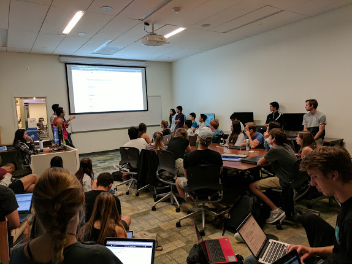
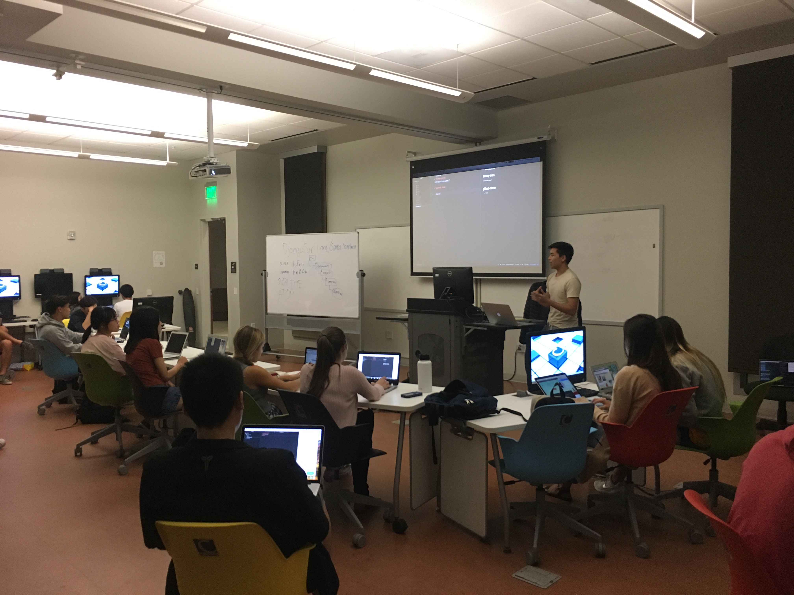

# Project Meeting Recap:  Week 1

## Project Group Meetings
Greetings, everyone! We hope everyone's quarter has been off to a great start! During Week 2, our club held its first official project group meetings of the quarter. Our project groups are split into two levels; The novice group meetings, led by Jason Freeberg and Raul Eulogio, are intended for those who have never completed a data science project. On the other hand, the advanced group meetings, led by Samantha Lee and Timothy Nguyen, are meant for those who wish to complete projects of their own choosing. The advanced group, which is led meets on Mondays saw a turnout of more than 55 people while the novice group which meets on Thursdays had more than 80 people in attendance during their first weeks.

## Advanced Meeting
#### Monday, October 9th, 2017
The advanced project meeting began with members being introduced to the club's methods involved in the progression of projects. After all the formalities, members were given time to brainstorm and discuss project ideas with their peers.  

Volunteers then proposed their projects to the club with the goal of recruiting teammates. This quarter, members generated exciting project ideas including, but not limited to chess move classification, music playlist generation, and NBA playoff outcome prediction. Additionally, less related to data science, but just as welcomed at our project group was a team working on drone control via hand sensors!  

After members settled into groups and exchanged contact information Timothy gave a run-down of how the projects would progress. He presented a guideline for completing projects, which highlighted concepts such as project planning, progress documentation, obstruction removal, and project publication.  

The advanced members finished off their first meeting with their project ideas decided, teams formed, and objectives set for next week's meeting.

## Novice Meeting
#### Thursday, October 12th, 2017
The first novice meeting kicked off with an introduction to data science and its applications in various fields. Then, members were presented with the purpose and method of the novice group: to walk attendees through the process of data science project by following along with already-done projects. Once members had a clearer understanding of data science and the nature of the novice group, they were then introduced to [R](https://www.r-project.org/) and [Python](https://www.python.org/) - the two programming languages recommended by the club for personal data science projects.  

  
Above: novice group members getting familiar with Atom, a popular text editor  

Members chose which language to learn and started with the basics by completing [DataCamp](https://www.datacamp.com/) exercises. (DataCamp is a club sponsor which provides a data science learning resource for all members.) The novice members finished their first meeting having set up accounts on DataCamp, beginning their journey into data science.

This wraps it up for the first club meetings of the quarter! Club meetings are held twice a week, on Mondays and Thursdays from 7:00 p.m. to 9:00 p.m. Advanced members meet on Monday, while novice members meet on Thursday. Meetings are held in SSMS and the Collaboratory, located in the Davidson Library. For more information on meetings, be sure to check out our [Facebook](https://www.facebook.com/DataScienceUCSB/) page!
