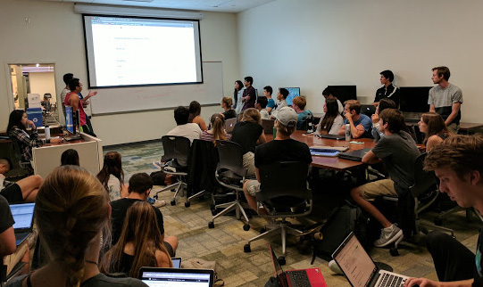

# Project Meeting Recap:  Week 1 

## Project Group Meetings 
Greetings! Hope everyone's quarter has been off to a great start! Campus organizations have started back up - and the Data Science club is no exception. Last week our club held its first official meetings of the quarter. The advanced meeting on Monday, October 9th, 2017 witnessed a turnout of more than 55 people. The novice meeting on Thursday, October 12th, 2017 had more than 80 people in attendance. 

## Advanced Meeting 
#### Monday, October 9th, 2017
Starting off the advanced meeting, members learned how the meetings would proceed each week and were also introduced to the club's process of completing projects. Members were asked to think of project ideas, which they then presented to the rest of the club. Volunteers then pitched their project ideas to the club, trying to get members to join their group. As ideas were exchanged, groups began to form as members teamed together to tackle their project ideas.  

After members formed groups and exchanged contact information, Timothy Nguyen, an officer of the club, gave a run-down of how the projects would go. He presented a guideline for completing projects, which included aspects such as:  

- **Documenting** project steps 
- **Setting** objectives for each week 
- **Encountering** obstacles 
- **Publishing** projects on [GitHub](github.com) and [inertia7](inertia7.com) 

The advanced members finished off their first meeting with their project ideas decided, their groups formed, and their objectives set for next week's meeting. 

## Novice Meeting 
#### Thursday, October 12th, 2017
The novice club meeting kicked off with an introduction to data science. The novice members learned what data science was, and its applications in various academic fields. Then members were presented with the goal of the novice group: to develop skills that enabled them to complete their own projects. After grasping an understanding of data science and the nature of the novice club meetings, members were then introduced to [R](https://www.r-project.org/) and [Python](https://www.python.org/) - two of the most popular programming languages used in data science.  

Below: novice group members learning how to use a text editor  
  

Members chose which language to learn and got right to work on [DataCamp](https://www.datacamp.com/). (DataCamp is a learning resource provided to all members of the club, helping novice members develop skills in R and Python.) The novice members finished their first meeting having set up accounts on DataCamp, beginning their journey into data science. 

This wraps it up for the first club meetings of the quarter! Club meetings are held twice a week, on Mondays and Thursdays from 7:00 p.m. to 9:00 p.m. Advanced members meet on Monday, while novice members meet on Thursday. Meetings are held in SSMS and the Collaboratory, located in the Davidson Library. For more information on meetings, be sure to check out our [Facebook](https://www.facebook.com/DataScienceUCSB/) page! 
 